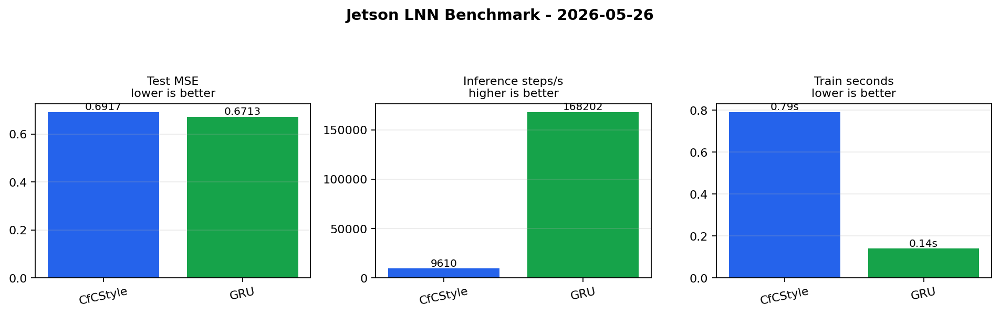

# Liquid Neural Networks (LNN) Research & Projects

欢迎来到 **LNN (Liquid Neural Networks)** 研究与开源项目追踪仓库。本仓库旨在收集、整理并分析液态神经网络领域的最新论文、开源项目以及相关的实验代码。

## 📂 目录结构

```text
LNN/
├── AGENTS.md                   # 自动化 Agent 规划与工作流说明
├── README.md                   # 项目概述与指南 (本文档)
├── docs/                       # 文档目录（调研报告、论文总结、学习笔记等）
├── papers/                     # 论文归档与每日追踪
│   └── daily/                  # 每日/定期论文抓取记录
├── skills/                     # 符合 Vercel Skills 标准的 AI Agents 技能库
│   ├── living-field-researcher/ # 领域持续研究与知识库沉淀工作流
│   ├── paper-analyzer/
│   │   └── SKILL.md
│   └── paper-translator/
│       └── SKILL.md
├── projects/                   # 开源项目克隆、复现代码与实验项目
├── analysis/                   # 实验结果分析、数据或可视化相关
└── scripts/                    # 自动化脚本（论文抓取、数据处理等）
```

## 🎯 项目目标

1. **追踪前沿**：持续追踪液态神经网络（LNN）及相关领域（如连续时间循环神经网络、神经常微分方程）的最新学术进展。
2. **源码分析**：汇总、分析和复现主流的开源 LNN 框架和应用案例（如时间序列预测、自动驾驶决策等）。
3. **自动化研究**：构建基于 AI Agent 的自动化信息收集与分析工作流，提升科研效率。

## 🚀 快速开始

- 想要了解当前最新进展，请阅读：[[液态神经网络最新进展与开源项目调研]]
- 想要了解最新的论文总结，请阅读：[[Liquid_Neural_Networks_Latest_Papers_Summary|LNN 最新论文总结]]
- 想要系统学习 LNN 如何构建数据集、搭建架构、训练和调参，请阅读：[[LNN_训练方法与方向可行报告]]
- 想要了解本仓库如何持续搜索、筛选和沉淀 LNN 领域知识，请阅读：[[LNN_持续研究协议]]
- 想要查看每日自动化追踪结果，请阅读：[[docs/daily/2026-05-25_LNN_research_digest|2026-05-25 LNN 每日研究追踪]]
- 想要配置本机每日任务或 Jetson 验证，请阅读：[[每日自动化任务与Jetson验证]]
- 关于本项目中自动化工具与工作流的规划，请参阅：[[AGENTS]]

### 自动化任务

本仓库已提供可直接运行的每日追踪入口：

```bash
# 只生成资料追踪，不提交
COMMIT_AND_PUSH=0 ./scripts/run_daily_lnn_task.sh

# 安装本机 user systemd timer，每天 06:30 自动运行并推送
./scripts/install_daily_lnn_timer.sh
```

GitHub Actions 也已配置 `.github/workflows/daily-lnn-research.yml`，会每天生成 LNN 资料摘要并推送回仓库。

### Jetson 验证

Jetson 本地 smoke benchmark（当前归档数据来自 Jetson Orin Nano；CUDA 容器内设备名显示为 `Orin`）：

```bash
RUN_BENCHMARK=1 COMMIT_AND_PUSH=0 ./scripts/run_daily_lnn_task.sh
```

如果 CUDA 容器因显存碎片或运行时内存分配失败退出，脚本会默认重试 2 次，再退回 CPU smoke benchmark 并在报告中标记 `ok_cpu_fallback`，便于保留当天验证记录。

当前真实 Jetson Orin Nano CUDA smoke benchmark（2026-05-26）：



| 模型 | 参数量 | 测试 MSE | 推理步/秒 | 训练秒 |
|---|---:|---:|---:|---:|
| CfCStyle | 329 | 0.691654 | 9,610.1 | 0.79 |
| GRU | 273 | 0.671285 | 168,201.6 | 0.14 |

- 设备：Jetson Orin Nano / CUDA device `Orin`
- 环境：Jetson Linux R36.4.7、PyTorch 2.10.0、CUDA 12.6
- 配置：合成非平稳时间序列，一步预测；samples=64、seq_len=16、hidden_size=8、epochs=1
- 完整记录：[[analysis/jetson/2026-05-26_lnn_benchmark]]

## 🌟 LNN 相关开源仓库 (Open Source Repositories)

以下是 GitHub 上一些高价值的液态神经网络 (LNN) 及液态时间常数网络 (LTC) 的开源实现与应用案例：

### 核心框架与实现
- [raminmh/liquid_time_constant_networks](https://github.com/raminmh/liquid_time_constant_networks): Liquid Time-Constant Networks (LTCs) 的经典代码仓库。
- [Ipsedo/LiquidNetworks](https://github.com/Ipsedo/LiquidNetworks): 使用 PyTorch 实现的 Liquid Time-Constant Networks。
- [emilierp/exact_lnn](https://github.com/emilierp/exact_lnn): 闭式液态神经网络 (Closed-Form LNNs) 的精确实现。
- [aygp-dr/liquid-neural-networks](https://github.com/aygp-dr/liquid-neural-networks): 混合 Clojure/Python 实现，参数高效的 LNN 架构（灵感来自秀丽隐杆线虫）。
- [KPEKEP/LTCtutorial](https://github.com/KPEKEP/LTCtutorial): 从零开始实现 Liquid Time-Constant Neural Network 的详尽教程。

### 实践与应用案例
- [makramchahine/drone_causality](https://github.com/makramchahine/drone_causality): 论文《Robust Visual Flight Navigation with Liquid Neural Networks》（基于 LNN 的无人机视觉飞行导航）的官方复现代码。
- [HusseinJammal/Liquid-Neural-Networks-in-Stock-Market-Prediction](https://github.com/HusseinJammal/Liquid-Neural-Networks-in-Stock-Market-Prediction): 使用 LNN 进行股市预测（如特斯拉和苹果）的数据驱动预测模型。
- [safipatel/LNN-cancer-classification](https://github.com/safipatel/LNN-cancer-classification): 基于 LNN 的癌症图像分类项目。
- [2ai-lab/LLNs-for-Early-Breast-Cancer-Detection](https://github.com/2ai-lab/LLNs-for-Early-Breast-Cancer-Detection): 利用 LNN 进行早期乳腺癌诊断的创新方法。
- [SeyedMuhammadHosseinMousavi/Liquid-Neural-Networks-LNNs-Classification](https://github.com/SeyedMuhammadHosseinMousavi/Liquid-Neural-Networks-LNNs-Classification): LNN 在基础分类、聚类和回归任务中的应用探索。

## 📝 Obsidian 导入说明与使用规则

本项目完全兼容并推荐作为 **Obsidian Vault (知识库)** 导入，以获得最佳的双向链接阅读与网状知识管理体验。

### 📥 如何导入

1. 下载或 Clone 本项目到本地：`git clone https://github.com/Dave-he/LNN.git`
2. 启动 Obsidian，点击 **"Open folder as vault" (打开文件夹作为仓库)**。
3. 选择本地的 `LNN` 文件夹。
4. 导入完成！你可以在 Obsidian 中直接查看、编辑和浏览各个 LNN 文档之间的双链关联。

### ✍️ 写作与文档维护规则

为了保证项目在 GitHub 上的可读性，同时发挥 Obsidian 的最大优势，请在协作时遵循以下规则：

1. **双向链接语法**：文档之间的交叉引用请优先使用双向链接 `[[页面名称]]` 或 `[[页面名称|显示别名]]`。GitHub 目前已原生支持解析此类链接。
2. **文档命名**：
   - 优先使用有意义的英文或中文命名。
   - 避免使用系统中不允许的特殊符号。多个单词建议使用下划线 `_` 或中划线 `-` 连接。
3. **附件与图片**：
   - 插入图片或 PDF 附件时，推荐统一放置在对应文档同级目录的 `assets/` 文件夹下。
   - 建议在 Obsidian 设置中将 `Default location for new attachments` 设置为 `In subfolder under current folder`，并命名为 `assets`。
4. **元数据 (YAML Frontmatter)**：
   - 建议在每篇新建研究报告或笔记顶部添加 YAML frontmatter，至少包含 `title`, `tags`, `date` 等字段，便于 Obsidian 进行检索与属性管理。

## 🤖 通用 Agents / Skills (基于 Vercel Skills)

本项目使用 [Vercel Skills](https://github.com/vercel-labs/skills) 规范来管理专门用于**领域持续研究、论文研读与分析**的 AI Agents，支持跨平台和跨模型（Claude, Gemini, Qwen, Cursor, Trae 等）使用。

关于如何通过软链接一键安装 `skills/` 目录下的 `living-field-researcher`、`paper-analyzer` 和 `paper-translator` 工具，以及项目中其他自动化 Agent 的规划，**请详细参阅：[[AGENTS]]**。

- `living-field-researcher`：面向任意研究领域的持续搜索、筛选、知识沉淀和实验队列维护；本仓库默认使用 LNN / LTC / CfC / NCP / LFM 研究画像。
- `paper-analyzer`：单篇论文结构化研读报告。
- `paper-translator`：学术论文与段落的中英互译。

## 🚀 后续计划

## 🛠️ 工程实践 (Engineering Practice)

本项目已搭建完整的 LNN 工程实践代码框架，支持从零实现和 ncps 库集成两种路径。

### 环境搭建

```bash
# 创建 conda 环境
conda create -n lnn python=3.11 -y
conda activate lnn

# 安装项目（含核心依赖）
pip install -e .

# 开发依赖
pip install -e ".[dev]"

# LFM2 模型推理（可选）
pip install -e ".[lfm]"
```

### 项目代码结构

```text
LNN/
├── lnn/                          # 核心 Python 包
│   ├── core/                     # LNN 核心实现（从零构建）
│   │   ├── liquid_neuron.py      # LiquidNeuron / LiquidLayer / LiquidNN
│   │   ├── ltc.py                # LTC (Liquid Time-Constant) 网络
│   │   ├── cfc.py                # CfC (Closed-form Continuous-time) 网络
│   │   └── trainer.py            # 通用训练引擎
│   ├── ncps_integration/         # ncps 库集成封装
│   │   └── ncps_models.py        # NCPSCfC / NCPSLTC / NCPSAutoNCP
│   ├── lfm2/                     # LFM2 液态基础模型推理与部署
│   │   └── inference.py          # LFM2Inference / LFM2EdgeDeployer
│   ├── data/                     # 数据加载与生成
│   │   ├── timeseries.py         # TimeSeriesDataset / Mackey-Glass / Sine
│   │   └── multimodal.py         # SyntheticMultimodalDataset / 多模态本机验证数据
│   └── utils/                    # 工具函数
│       ├── metrics.py            # MSE / RMSE / MAE / MAPE
│       └── visualization.py      # 训练曲线 / 预测图 / 对比图
├── scripts/                      # 实验脚本
│   ├── experiment_timeseries.py  # 单模型时间序列预测实验
│   ├── experiment_multimodal_lnn.py # 本机多模态 LNN 实验
│   └── benchmark_comparison.py   # LNN vs LSTM vs GRU 对比基准
├── configs/                      # 实验配置文件
│   ├── default.yaml
│   ├── ltc_sine.yaml
│   └── benchmark.yaml
├── tests/                        # 单元测试
│   └── test_core.py
├── analysis/                     # 实验结果输出
└── pyproject.toml                # 项目配置与依赖
```

### 快速运行实验

```bash
# CfC 模型 - 正弦波预测
python scripts/experiment_timeseries.py --model cfc --data sine --epochs 50

# LTC 模型 - Mackey-Glass 混沌时间序列
python scripts/experiment_timeseries.py --model ltc --data mackey_glass --epochs 50

# 模型对比基准测试（CfC vs LTC vs LSTM vs GRU）
python scripts/benchmark_comparison.py --data mackey_glass --epochs 50

# OOD 泛化实验：验证 LNN 对分布偏移的鲁棒性
python scripts/experiment_ood.py --epochs 50

# 概念漂移实验：验证 LNN 对 Regime Change 的适应性
python scripts/experiment_concept_drift.py --epochs 50

# AutoNCP 稀疏神经电路实验
python scripts/experiment_autoncp.py --epochs 50

# 本机多模态 LNN：传感器序列 + 图像 + 文本 token
python scripts/experiment_multimodal_lnn.py --model cfc --samples 360 --epochs 8 --device cpu
```

### 本机多模态 LNN 验证

已新增 `scripts/experiment_multimodal_lnn.py`，用于在无外部数据下载的情况下验证 LNN 处理多模态输入：

- `sensor`：时序传感器特征，作为 LNN 的时间主轴。
- `image`：小尺寸灰度图像模式，经 CNN 编码为静态上下文。
- `tokens`：短文本 token 序列，经 Embedding/mean pooling 编码为静态上下文。
- 融合方式：将 image/text 上下文广播到每个时间步，与 sensor 编码拼接后输入 CfC 或 LTC。

最近一次本机 CPU smoke run 输出见：[[analysis/multimodal/2026-05-26_115225_multimodal_lnn]]

### 在代码中使用

```python
import torch
from lnn.core.cfc import CfCNetwork
from lnn.core.ltc import LTCNetwork
from lnn.data.timeseries import generate_mackey_glass, create_dataloader
from lnn.core.trainer import Trainer

# 生成数据
data = generate_mackey_glass(num_samples=2000, tau=17)
train_loader = create_dataloader(data[:1400], seq_len=32, horizon=1)

# 创建 CfC 模型
model = CfCNetwork(input_size=1, hidden_size=32, output_size=1)

# 训练
trainer = Trainer(model, lr=1e-3, patience=15)
history = trainer.fit(train_loader, num_epochs=50)
```

### Jetson Orin Nano 实测 Benchmark

README 不再固化桌面/示例实验数值；下表与图来自 `analysis/jetson/2026-05-26_lnn_benchmark.json` 的真实 Jetson Orin Nano CUDA smoke test。


| 模型 | 参数量 | 测试 MSE | 推理步/秒 | 训练秒 |
|---|---:|---:|---:|---:|
| CfCStyle | 329 | 0.691654 | 9,610.1 | 0.79 |
| GRU | 273 | 0.671285 | 168,201.6 | 0.14 |

本次 benchmark 是 quick smoke test，用于验证 Jetson 上的数据生成、训练、推理和结果归档链路。正式性能结论应提高样本数、隐藏维度、epoch，并加入多次重复与置信区间。
