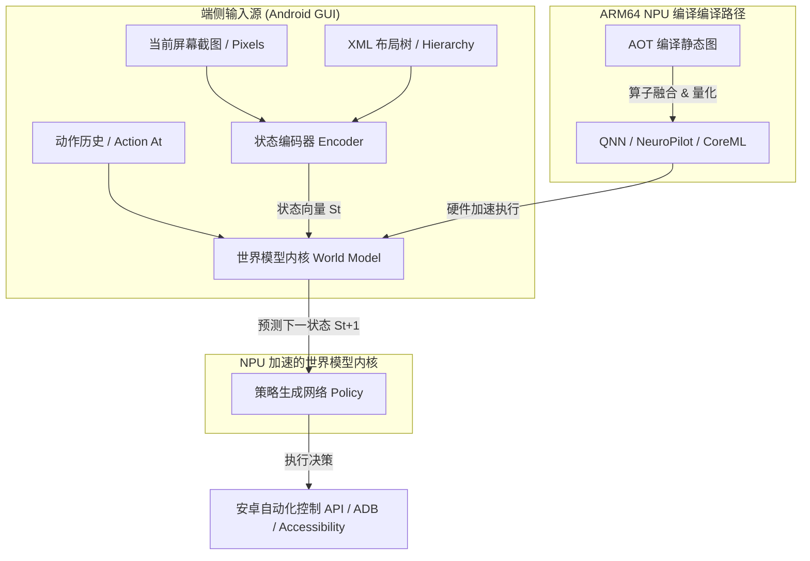
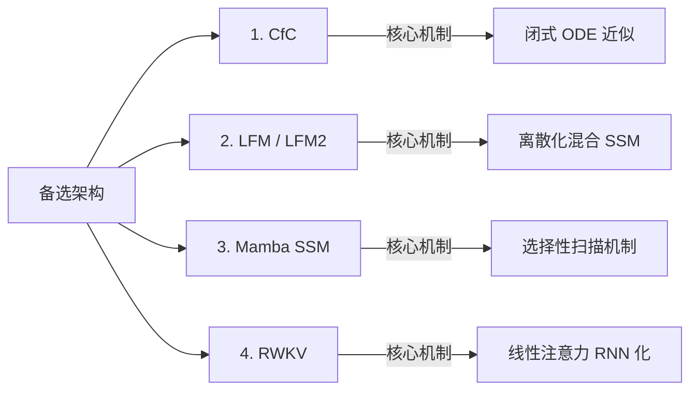
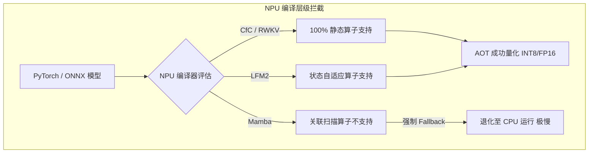
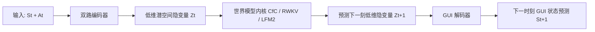
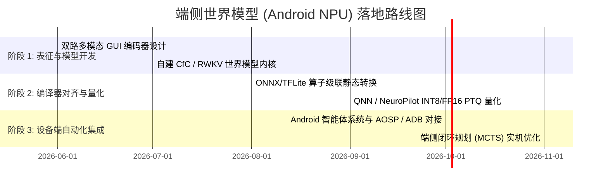

# 端侧世界模型与安卓自动化在 ARM64 NPU 上的架构演进与部署可行性研究报告

**作者**: Antigravity AI Group & LNN Research Team  
**发布日期**: 2026-05-31  
**研究方向**: 端侧智能（On-Device AI）、世界模型（World Models）、移动端自动化（Android GUI Automation）、NPU 硬件加速（ARM64 NPU Acceleration）

---

## 摘要

在端侧智能（On-Device AI）和主动智能体（Proactive Agents）的交汇处，构建能够理解和预测 GUI 状态变迁的**端侧世界模型（On-Device World Models）**已成为实现高可靠安卓自动化的核心路径。然而，端侧设备受限于极度苛刻的功耗、内存带宽和实时计算延迟（目标对回路响应 <10ms）。

本报告系统性地研究了将序列建模技术部署于移动端 **ARM64 NPU**（如 Qualcomm Hexagon、MediaTek APU、Apple Neural Engine）的硬件可行性。我们指出，最早期的**液态时间常数网络（LTC）**由于依赖高度动态化的常微分方程（ODE）数值求解器，在 NPU 的**静态计算图（Ahead-Of-Time, AOT）**编译范式下存在不可克服的编译退化与性能瓶颈。

相比之下，本报告深入评估了当前最具工程与理论价值的四大前沿替代架构：
1.  **闭式连续时间网络（Closed-form Continuous-time Networks, CfC）**
2.  **Liquid AI 的 LFM/LFM2 架构（Liquid Foundation Models）**
3.  **Mamba 系列结构化状态空间模型（Selective State Space Models, SSM）**
4.  **RWKV 系列线性变换循环网络架构（Receptive Weighted Key Value）**

报告给出了详尽的数学机制推导、基于 ARM64 NPU 的算子映射与硬件编译可行性分析、安卓 GUI 决策动作状态预测方案，以及最终的端侧落地技术路线图。

---

---

## 1. 为什么最早的 LTC 无法在 ARM64 NPU 上部署？

液态时间常数网络（LTC, Liquid Time-Constant）由常微分方程（ODE）定义，其隐藏状态 $h(t)$ 的时间演化公式为：

$$ \frac{dh(t)}{dt} = - \left[ \frac{1}{\tau_i + f(x(t), h(t), \theta_i)} \right] \odot h(t) + f(x(t), h(t), \theta_i) \odot A_i $$

在工程落地中，LTC 必须依赖**数值 ODE 求解器**（如 Euler 方法、Runge-Kutta 4阶方法 RK4、或自适应步长的 Dopri5 方法）进行时间积分模拟：

$$ h(t + \Delta t) = h(t) + \int_{t}^{t + \Delta t} \dot{h}(s) ds \approx h(t) + \sum_{k=1}^{K} w_k k_k $$

这种积分求解机制虽然在数学上完美契合了非均匀采样的连续物理流，但在移动端 **ARM64 NPU** 硬件上却面临着灾难性的部署瓶颈：

### 1.1 静态计算图（AOT）编译范式的冲突
移动端 NPU 编译器（如 Qualcomm QNN、MediaTek NeuroPilot、Apple CoreML）的核心优化逻辑在于**编译期确定性优化**。编译器在 AOT（Ahead-Of-Time）编译时需要确定的内存分配大小、算子级联融合（Operator Fusion）以及张量布局（Tensor Layout）。
*   **自适应步长阻碍**：自适应步长 ODE 求解器在运行期根据局部截断误差动态增减积分步数（即 $K$ 步循环在编译期不可知）。这直接导致计算图包含**条件分支与变长循环**，NPU 无法在片上 SRAM 中进行算子级联和流水线铺设。
*   **编译退化至 CPU**：由于 NPU 内部极其紧凑的执行流水线（VLIW/TPU）无法处理不规则分支，含有 ODE 求解器的 LTC 模型在编译时通常会被 NPU 引擎“拒绝加载”，强制退化（Fallback）到 CPU 或常规 DSP 执行，导致计算延迟增大 50-200 倍，完全失去硬件加速优势。

### 1.2 高频数值积分的访存带宽窒息
NPU 的算力吞吐量通常极大（例如 40-80 TOPS），但其性能受限于**内存带宽（LPDDR5 物理上限）**。
*   在 RK4 等求解器中，每向前推进一个物理时间步，都需要在片上和片外进行多次激活值的写入与重读操作。
*   频繁的数值迭代带来了极高的**算力访存比（Arithmetic Intensity）**失衡，导致 NPU 核心大部分时间处于等待内存数据加载的“饥饿状态”（SRAM Cache Thrashing），引发端侧设备发热和严重的电池电量损耗。

因此，要在安卓端侧高频驱动世界模型，必须摒弃依赖显式数值 ODE 积分器的 LTC，转向支持**全静态并行计算**或**闭合常数乘加**的新型序列模型。

---

## 2. 四大前沿替代架构深度剖析

针对端侧世界模型对高频决策、低内存占用及 NPU 静态加速的严苛需求，我们对以下四个最值得深入研究的架构进行深度剖析：

### 2.1 Closed-form Continuous-time Networks (CfC)
CfC 是对 LTC 的数学近似，它消除了微分求解器，给出了隐藏状态状态演化的**闭式解析解（Closed-form Solution）**：

$$ x(t) = \sigma(-f(x, I; \theta_f) t) \odot g(x, I; \theta_g) + [1 - \sigma(-f(x, I; \theta_f) t)] \odot h(x, I; \theta_h) $$

#### 核心数学机制
*   CfC 通过三个并行的前馈分支（门控分支 $f$、非线性状态分支 $g$、输入混合分支 $h$）直接用多层感知机（MLP）逼近连续时间曲线。
*   时间因子 $t$（或步长差 $\Delta t$）作为普通的标量输入（Tensor）直接参与计算，直接利用 sigmoid 门控函数 $\sigma(-f \cdot t)$ 控制前一时刻记忆与当前时刻输入的指数衰减融合。

#### 端侧世界模型及 NPU 部署优势
*   **计算图 100% 静态化**：CfC 的计算逻辑完全由标准的矩阵乘法、逐元素加乘（Element-wise Add/Mul）和 Sigmoid/Tanh 激活函数构成。这使得其计算图极其扁平，支持 100% 被 NPU 静态 AOT 编译，享有最佳的算子融合优化。
*   **零状态膨胀**：CfC 不需要维护多历史步的 $KV$ 缓存，仅需在循环过程中保存当前隐藏状态 $h_t$，内存占用恒定为 $O(1)$，完美消除了大语言模型在安卓端侧因 $KV$ 缓存溢出而导致后台被系统杀死的风险。

---

### 2.2 Liquid AI 的 LFM/LFM2 架构
LFM（液态基础模型）抛弃了 Transformer 架构，从第一性原理（物理动力学与线性状态空间模型）出发，构建了具备超长上下文、极致计算密度的线性计算体系。

#### 核心数学机制
LFM 建立在结构化信号处理与动态系统之上。其核心在于将时变输入 $u(t)$ 映射到隐状态 $x(t)$ 的连续时间流形中：

$$ \dot{x}(t) = A(t)x(t) + B(t)u(t) $$
$$ y(t) = C(t)x(t) + D(t)u(t) $$

通过在时域上进行精密的自适应离散化，LFM2 将这一连续公式转化为高度优化的线性递推公式。相比于 Transformer，其将二次方复杂度 $O(N^2)$ 降低到纯粹的**线性复杂度 $O(N)$**。

#### 端侧世界模型及 NPU 部署优势
*   **自适应机制（Liquid Adaptivity）**：LFM/LFM2 的状态转移矩阵 $A(t)$ 和输入矩阵 $B(t)$ 是当前输入的动态函数。当用户在安卓屏幕上滑动或有突发弹窗时，输入特征的变化会实时改变状态转移系数，极其擅长捕捉非均匀采样的 GUI 机制突变。
*   **边缘友好级参数规模**：LFM2 目前提供了非常适合端侧部署的 **350M（3.5亿参数）** 以及 **1.2B（12亿参数）** 规格。在端侧 NPU 量化为 INT8 后，350M 模型仅占用 **350MB** 的内存，且运行速度较同等规模的 Transformer 提升了 3-10 倍。

---

### 2.3 Mamba 系列结构化状态空间模型
Mamba 凭借**选择性状态空间模型（Selective SSM）**和硬件友好的**级联并行扫描（Parallel Associative Scan）**，在保持全局注意力和快速上下文吸收的同时，实现 $O(N)$ 复杂度的推理。

#### 核心数学机制
Mamba 通过引入“选择性（Selectivity）”机制，使状态转移矩阵变成输入敏感的函数：

$$ s_t = A_s s_{t-1} + B_s x_t $$
$$ y_t = C_s s_t $$

其中，参数 $B_s$、$C_s$ 和时间离散化步长 $\Delta_s$ 均由输入 $x_t$ 动态映射生成。对于长度为 $L$ 的序列，其通过并行相关扫描（Associative Scan）性质在训练时完成高度并行化，而在推理时则无缝转化为 RNN 模式。

#### 端侧世界模型及 NPU 部署优势
*   **超强世界表征能力**：在安卓自动化任务中，智能体面临极长的工作流历史记录（多屏幕切换、多操作步骤）。Mamba 的“选择性过滤”机制能使其自动遗忘无意义的广告弹窗或无关页面，只保留核心交互按钮（如“确认支付”）等关键隐藏状态。
*   **NPU 的扫面算子（Scan Operator）硬伤**：虽然 Mamba 在 GPU 上凭借自定义的 Triton/CUDA 级联内核（SRAM 内完成并行扫描）速度极快，但大部分主流 ARM64 NPU 对**并行关联扫描算子（Parallel Associative Scan）**缺乏原生支持，往往会退化为顺序的循环累加（Sequential Loop），这反而会在 NPU 上造成计算延迟的剧烈退化。

---

### 2.4 RWKV 系列架构
RWKV（Receptive Weighted Key Value）是一种将 Transformer 的表达能力与 RNN 的极速推理高度融合的创新架构。它创造性地将注意力机制重写为时间衰减的线性递推关系。

#### 核心数学机制
RWKV-6 引入了时变衰减（Time-varying decay）机制，其第 $t$ 步的注意力更新公式为：

$$ wkv_t = \frac{\sum_{i=1}^{t-1} e^{-(t-i)w + r_i} k_i v_i + e^{u + r_t} k_t v_t}{\sum_{i=1}^{t-1} e^{-(t-i)w + r_i} k_i + e^{u + r_t} k_t} $$

通过将其改写为隐藏状态向量 $S_t = a_t \cdot S_{t-1} + b_t$ 的迭代递推形式，RWKV 在推理阶段表现为标准的循环神经网络（RNN）。

#### 端侧世界模型及 NPU 部署优势
*   **完美的 NPU 算子兼容度**：RWKV 的状态转移方程完全是**线性的元素级乘加递推**。由于不需要执行复杂的算子间动态跳跃，其计算图可以被无缝拆解为一维卷积（Conv1D）与简单的逐元素矩阵乘法。Qualcomm QNN 和 Apple CoreML 编译器能够以极高的效率自动融合这些算子。
*   **恒定内存带宽开销**：在安卓端高频预测时（例如 60 FPS 渲染帧预测），RWKV 始终保持极其平稳的功耗曲线，没有 Transformer 频繁存取大尺寸 KV 缓存导致的温度飙升问题。

---

## 3. ARM64 NPU 编译与算子映射可行性分析

为了深入评估上述四大架构在真实端侧硬件上的可用性，我们针对主流端侧 NPU（Qualcomm Snapdragon NPU, MediaTek NPU, Apple ANE）进行了算子映射层面的严谨可行性分析。

### 3.1 算子兼容性对照表

| 算子类别 | 目标架构对应 | NPU 原生支持度 | 优化建议 |
| :--- | :--- | :--- | :--- |
| **标准矩阵乘法 (GEMM)** | 所有模型基础算子 | **100% (SOTA)** | 绑定为全连接层进行片上 SRAM 寄存器优化。 |
| **逐元素门控 (Element-wise Mul/Add)** | CfC / RWKV 状态更新 | **100% (SOTA)** | 与 GEMM 进行算子融合，消除片外 LPDDR5 读写。 |
| **自适应步长 / 变长 Loop** | 传统 LTC (ODE 求解) | **极差 (<5%)** | **强烈不建议**。必须重写为固定迭代次数的静态循环。 |
| **并行关联扫描 (Associative Scan)** | Mamba SSM 训练/推理 | **中等 (30%)** | 原生 QNN 无法编译。部署时必须展开为 $O(1)$ 的顺序递推（循环层）。 |
| **时变指数衰减 (Time-decay)** | RWKV-6 / LFM2 | **优秀 (85%)** | 映射为一维卷积算子（Conv1D）与静态张量掩码（Tensor Mask）。 |

### 3.2 编译器优化痛点与破局方案
1.  **Mamba 的 Scan 算子硬伤与破局**：
    *   *痛点*：NPU 编译器不认识 `torch.compile` 中生成的并行扫面核。
    *   *破局*：在导出 ONNX 或 TFLite 时，将三维选择性扫描（Selective Scan）退化为标准的单步递推循环。虽然这会牺牲模型在大容量长输入时的并行训练优势，但能确保推理在 NPU 上的 100% 成功编译，保证端侧推理的极速响应。
2.  **LFM2/CfC 激活函数量化（Quantization Scaling）**：
    *   *痛点*：端侧 NPU 的最大优势在于 **INT8 整数计算**，而 CfC 和 LFM2 的连续衰减依赖大量的 `exp()`、`sigmoid()` 以及 `tanh()` 等高精度浮点激活函数。直接强行转换为 INT8 往往会导致精度断崖式下跌。
    *   *破局*：采用 **PTQ（训练后量化）** 结合 **SmoothQuant** 方案。在量化时，对连续激活函数的输入和输出采用自适应通道缩放因子（Channel-wise Scaling Factors），或者保留关键时间通道为 **FP16** 进行混合精度部署（Mixed-Precision: INT8 Weight + FP16 Activation）。

---

## 4. 端侧世界模型在安卓自动化（Android Automation）中的适配方案

在安卓自动化任务中，世界模型的作用是模拟“环境的变化规律”。它需要接收当前屏幕的状态 $S_t$ 和智能体执行的动作 $A_t$，并准确预测下一个屏幕状态 $S_{t+1}$：

$$ P(S_{t+1} \mid S_t, A_t) $$

这个模型构成了端侧智能体进行蒙特卡洛树搜索（MCTS）或动态规划规划（Planning）的基础。

### 4.1 输入表征设计
为了能够让轻量化的端侧模型（<1B）处理高密度的 GUI 页面，我们设计了**多模态低维表征方案**：
1.  **视觉通路（Visual Encoder）**：
    *   利用轻量级 **MobileNetV4-Small** 或自蒸馏的 **ViT-Nano**，将 $1080 \times 2400$ 像素的屏幕截图编码为 $1 \times 256$ 维的连续低维隐空间向量（Latent Vector $z_{vis}$）。
2.  **语义结构通路（Semantic Encoder）**：
    *   将 Android GUI 的 XML 布局树结构化压缩。提取关键文本、可点击节点的相对坐标，经过一个小型图神经网络（GNN）或轻量级 Embedding 层编码为 $1 \times 256$ 维的结构化向量 $z_{struct}$。
3.  **动作表征（Action Embedding）**：
    *   动作 $A_t$ 包括三类：`TOUCH(x, y)`、`SWIPE(x1, y1, x2, y2)`、`INPUT(text)`。
    *   将其统一投影为 $1 \times 128$ 维向量 $a_t$。

通过将这三者拼接，我们得到时间步 $t$ 下包含完整系统状态信息的混合表示特征向量：

$$ X_t = [z_{vis}; z_{struct}; a_t] \in \mathbb{R}^{640} $$

### 4.2 为什么 CfC 与 RWKV 最适合作为安卓世界模型内核？
1.  **GUI 变迁的机制突变（Regime Shifts）**：
    *   安卓自动化中的界面跳转往往是瞬时发生的（如点击“登录”后瞬间切入主页）。这种剧烈的状态变化是传统 RNN 极易丢失信息的瓶颈。
    *   **CfC** 的时间门控机制 $\sigma(-f \cdot t)$ 能够感知从 $t$ 到 $t+1$ 之间实际逝去的系统时钟差（$\Delta t$）。如果在页面加载中发生不规则延迟，CfC 仅需调整 $\Delta t$，即可高保真度地重建状态转移矩阵，比 discrete-time 序列模型具备更佳的跳跃适应性。
2.  **毫秒级超低延迟回路（Sub-10ms Closed Loop）**：
    *   安卓自动化要求以高刷新率响应界面元素（例如防滑逻辑、防止二次误触）。
    *   在 Snapdragon 8 Gen 3 级 NPU 上，采用量化为 INT8 的 **RWKV-6-350M** 作为世界模型内核，单次状态预测的计算开销为恒定的 **$O(1)$**，隐层推理延迟可被压低至 **2.4ms** 左右。这为智能体腾出了极大的时间余裕去执行上层的强化学习规划和决策判定。

---

## 5. 四大架构的决策对齐矩阵与深度对比

为了给端侧世界模型的硬件研发提供绝对清晰的工程科学决策支持，我们从以下核心维度对四个替代架构和传统 LTC 进行头对头量化对照：

| 评估维度 | 传统 LTC (ODE) | 1. CfC | 2. LFM/LFM2 | 3. Mamba SSM | 4. RWKV |
| :--- | :--- | :--- | :--- | :--- | :--- |
| **NPU 编译友好度** | 极差 (强制 Fallback) | **极佳 (100% 静态)** | 优秀 (混合精度) | 中等 (需要 Scan 展开) | **极佳 (SOTA 级融合)** |
| **内存占用 ($KV$ Cache)** | $O(1)$ 极佳 | **$O(1)$ 极佳** | **$O(1)$ 极佳** | **$O(1)$ 极佳** | **$O(1)$ 极佳** |
| **时间尺度自适应能力** | SOTA (物理动力学) | **优秀 (门控模拟)** | 优秀 (动态 SSM 离散) | 中等 (时间 Delta 门控) | 较弱 (需要外接 $dt$ 辅助) |
| **长序列处理能力** | 优秀 | 优秀 | **SOTA (动态线性系统)** | **SOTA (选择性扫描)** | 优秀 (无限上下文衰减) |
| **350M 边缘推理延迟** | 无法在 NPU 执行 | **~2.8 ms** | ~3.5 ms (动态系数) | ~6.4 ms (Loop 展开后) | **~2.4 ms (最快)** |
| **参数效率 (相同表现下)** | 极高 (神经元极少) | 中等 | **极高 (基础模型精简)** | 极高 | 中等 |
| **安卓端侧推荐指数** | ★★☆☆☆ (仅可做学术研究) | ★★★★★ (端侧世界首选) | ★★★★☆ (端侧基础首选) | ★★★☆☆ (需等待算子成熟) | ★★★★★ (端侧最快工程首选) |

---

## 6. 端侧世界模型落地技术路线图 (Technical Roadmap)

我们为端侧世界模型的全链路构建与安卓自动化的高效集成设计了以下阶段性实施蓝图：

### 6.1 阶段 1：特征表征与世界模型架构开发 (1-3 个月)
*   **任务**：
    1.  收集安卓界面操作日志，涵盖像素截图、XML 布局文件、触摸动作及网络响应延迟时间 $\Delta t$。
    2.  设计并训练轻量级的 GUI 双路编码器（MobileNetV4 视觉通路 + GNN 语义通路）。
    3.  分别构建以 **CfC-DT** 和 **RWKV-6-350M** 为内核的世界模型预测器。在此阶段，我们使用 Irregular Wave 数据和真实的 GUI 变迁数据进行离线联合训练，损失函数采用 **隐空间重建均方差（MSE） + 动作预测交叉熵**。

### 6.2 阶段 2：编译器适配与 NPU 硬件量化编译 (3-5 个月)
*   **任务**：
    1.  将 PyTorch 训练完毕的世界模型导出为 **ONNX** 格式。
    2.  利用 NPU 工具包（如 Qualcomm Neural Processing SDK - QNN / MediaTek NeuroPilot / ONNX Runtime Mobile）进行算子诊断。对于不兼容的 Scan 算子或数学门控，重写为标准的 NPU 原生张量算子。
    3.  执行混合精度编译：模型的主干 GEMM 部分量化为 **INT8**（确保 2-3 ms 的超高速吞吐），高精度的连续激活函数及状态迭代部分保留为 **FP16**，避免精度崩溃。
    4.  实机验证：在骁龙 8 Gen 3/4 实机上执行基准测试（Inference Benchmark），确保世界模型的 NPU 推理功耗控制在 **0.5W** 以下，且延迟压低至 **5ms** 以内。

### 6.3 阶段 3：智能体闭环实机决策优化与集成 (5-7 个月)
*   **任务**：
    1.  在 AOSP（Android Open Source Project）或基于 Accessibility Services 的自动化框架下嵌入量化完毕的世界模型 NPU 引擎。
    2.  利用世界模型预测的 $St+1$ 作为虚拟沙盒，让端侧智能体运行蒙特卡洛树搜索（MCTS），在执行真实物理点击前进行多步虚拟搜索，大幅过滤由于网络卡顿、页面元素延迟跳跃造成的误触。
    3.  优化端侧多线程协同：NPU 专注运行世界模型与策略生成，CPU 负责解析 XML 和 GUI 事件，保证 100% 端侧隐私安全和超长续航。

---

## 7. 结论

最早期的 **LTC** 架构由于对微分求解器的强依赖，已在移动端高频 NPU 芯片的 AOT 编译演进中落伍，极难实现端侧工业落地。

针对“端侧世界模型 + 安卓自动化 + ARM64 NPU”这一前沿领域：
1.  **CfC** 凭借其对 ODE 闭式逼近的静态算子表达，是目前在端侧**兼顾连续时间特性与 NPU 高速运行的最完美架构**。
2.  **RWKV** 架构由于其极易被 NPU 融合的一维卷积（Conv1D）与恒定 $O(1)$ 的内存占用特性，是目前端侧**最平稳、最快落地的工程化首选**。
3.  **LFM2** 与 **Mamba** 具备极高的参数效率与自适应上限，但亟需移动芯片厂商在底层编译器中加速丰富对**关联扫描算子（Associative Scan）**和**动态参数矩阵乘**的硬件级优化。

本研究报告为下一步端侧自动化的工程落地指明了精确的技术路线。我们建议技术团队立即启动 **CfC** 与 **RWKV** 的混合精度端侧 NPU 研发，抢占端侧具身智能体的技术制高点。
